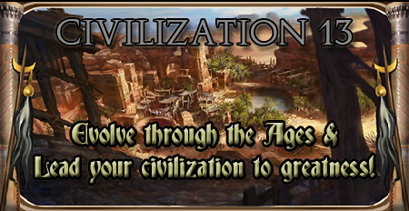
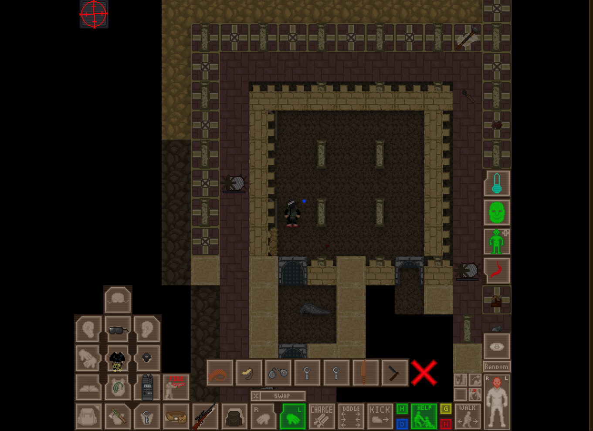
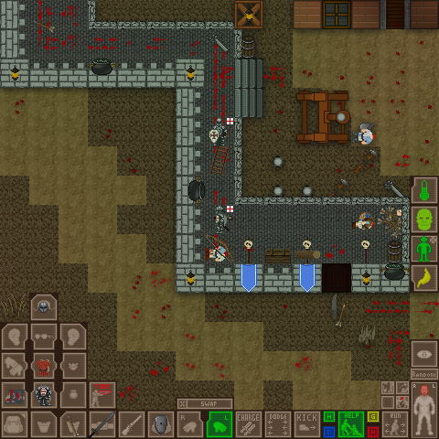

Civ13 is a game based on Space Station 13 code, which features several epochs of human history. (hence the name). It features both Roleplay-oriented and Team-Deathmatch modes, with the main one being Nomads, in which you need to bring your civilization from the Stone Age to the Modern Age.
RP gamemodes, especially the Nomads maps, are focused on building and interacting with other players.

Nomads mode is a subtype of the Civilization 13 mode. In Nomads Mode, everyone spawns without any pre-determined factions, with only a knife and basic clothing.You can stay factionless (a nomad), create your own or be invited to one. However, research points can only be collected if you have a faction.

Combat gamemodes have different maps from prehistory to modern times.